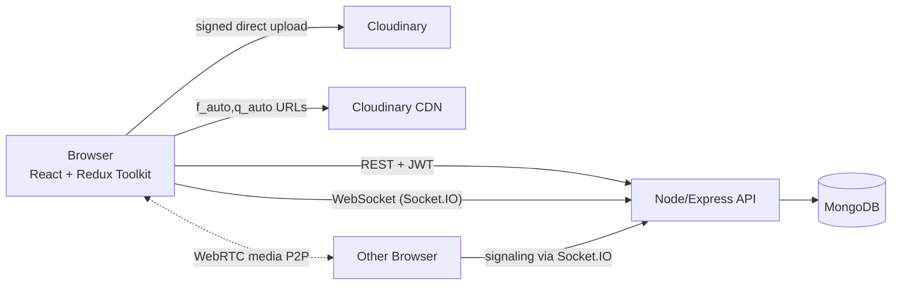

# Huddle — Interview Notes

> Code: `dev-aabhinav/Huddle-Real-Time-Social-Platform` (branch `claude/huddle-mern-project-a4v3pf`)
> Rule: every number here comes from a benchmark I actually ran. If not run yet → **NOT MEASURED**.

---

## 1. One-line pitch (30 seconds)

Huddle is a MERN social platform where users post, follow each other, chat in real time over
Socket.IO and make 1:1 video calls over WebRTC. I built it end to end — REST API with JWT auth,
React + Redux Toolkit frontend, Cloudinary image pipeline — and load-tested the chat server to find
its real capacity and first bottleneck. *(Capacity numbers: NOT MEASURED yet.)*

---

## 2. Architecture

> Status: **planned**. Only the Express server + `/api/health` exists after Milestone 1.

**Data flow (target):** The browser calls REST endpoints with a JWT in the `Authorization` header;
Express middleware verifies it and the route reads/writes MongoDB. Chat messages go over a Socket.IO
connection (authenticated with the same JWT at handshake), are saved in MongoDB, and are emitted to
the conversation's room. Images upload straight from the browser to Cloudinary using a signature
from our server, and are served through Cloudinary's CDN with format/quality transforms. Video calls
use Socket.IO only to exchange SDP offers/answers and ICE candidates; the audio/video itself flows
peer-to-peer.

---

## 3. Tech stack

| Tool | Layman meaning | Why used here | Alternative I didn't pick & why |
|---|---|---|---|
| Node.js | Runs JavaScript outside the browser | One language front+back; event loop is good for many idle connections (chat) | Go/Java — better CPU-bound perf, but more boilerplate and second language |
| Express 5 | The waiter that routes orders to the right kitchen station | Minimal, huge ecosystem; v5 forwards async errors to the error handler automatically | Express 4 (needs `asyncHandler` wrapper for async errors); Fastify (faster, less familiar to interviewers); NestJS (heavy structure) |
| dotenv | Reads secrets/config from a `.env` file | 12-factor config without hard-coding | Node's built-in `--env-file` flag (Node ≥ 20.6) — fine too, dotenv is more recognised |
| nodemon | Auto-restarts server on file save | Dev convenience only (devDependency) | `node --watch` (built into Node 18+) |
| MongoDB | — | *(Milestone 2)* | — |
| React / Redux Toolkit | — | *(Milestone 6)* | — |
| Socket.IO | — | *(Milestone 9)* | — |
| WebRTC | — | *(Milestone 11)* | — |
| Cloudinary | — | *(Milestone 7)* | — |

---

## 4. Milestones

### Milestone 1: Hello server

**What I built:** An Express 5 server with `GET /api/health`, a JSON 404 handler, a central error
handler and graceful shutdown on SIGINT/SIGTERM. The app is built in `createApp()` (no `listen`) so
tests can import it without opening a port.

**MEMORISE**
- Files: `server/src/app.js` (builds app, exports `createApp`), `server/src/server.js` (dotenv → listen → shutdown).
- Route: `GET /api/health` → `200 {status:"ok", uptimeSeconds, timestamp}`. Public.
- Port from `process.env.PORT`, default `5000`.
- `express.json({ limit: "100kb" })` — bodies above 100 kb are rejected (413).
- `app.disable("x-powered-by")` — hides the "Express" header.
- Middleware order: json parser → routes → 404 handler → error handler (4 args).
- 500 errors: full error logged on server, client only sees `"Internal server error"`.
- Malformed JSON → 400 (client error), not 500.
- Versions: Node v22.22.0, Express 5.2.1.

**UNDERSTAND**
- Client/server, HTTP request (method, path, headers, body) and response (status, headers, body).
- Status code families: 2xx ok, 4xx client mistake, 5xx server mistake.
- Node event loop: single thread + non-blocking I/O; great for I/O-bound work, bad for CPU-bound.
- Middleware pipeline `(req, res, next)`; order of registration = order of execution.
- Error middleware is recognised by having 4 parameters.
- Liveness vs readiness probes.
- Graceful shutdown: `server.close()` stops new connections, lets in-flight requests finish.
- 12-factor config: settings in environment variables, secrets never in git (`.env` gitignored, `.env.example` committed).

**Interview questions**
- *Node is single-threaded — how does it serve 1000 concurrent requests?* → Event loop + non-blocking I/O; I/O waits are handed to the OS/libuv, the thread keeps serving others. → *Follow-up: when does it break?* CPU-bound work blocks everyone; fix with worker threads / separate service / cluster.
- *What is middleware, why does order matter?* → Function in the request pipeline that ends the response or calls `next()`; runs in registration order (json parser before routes, 404 last). → *Follow-up: how does Express know it's an error handler?* 4 arguments.
- *Why split app.js and server.js?* → Tests (Supertest) can use the app without a port; Socket.IO later attaches to the `http.Server`. → *Follow-up: how will Socket.IO attach?* `http.createServer(app)` then `new Server(httpServer)`.
- *What does your health check verify?* → Only liveness (process up). Readiness would also check DB. → *Follow-up: should it query the DB every time?* No — cheap ping/cached state, else probes add load and can cascade.
- *Why graceful shutdown?* → Deploys send SIGTERM; without it in-flight requests are dropped. → *Follow-up: WebSockets?* Long-lived, never "finish" — need a timeout and client reconnect logic.

**Scaling questions**
- *What breaks first at 100x?* → One Node process uses one CPU core (machine has 4). Detect: one core at 100%, event-loop lag rising. Fix: cluster/PM2 (1 process per core), then more machines behind a load balancer.
- *Why can we scale horizontally at all?* → The app is stateless (no per-user data in process memory). Must stay that way: JWT for auth (M3), Redis adapter for sockets (M13).
- *Can a health check cause an outage?* → Yes, if liveness depends on the DB: DB slow → all instances marked unhealthy → LB has no backends (cascading failure).
- *1 lakh users, can one process handle it?* → Unknown until measured. Rough reasoning: 1 lakh users × 1 req/10 s ≈ 10k req/s, likely beyond one core → cluster + several instances. **Capacity NOT MEASURED (M10).**

**Honest weakness + fix**
- Health check is liveness-only — no readiness check. Fix: add `/api/ready` that checks DB connection state (M2).
- No request logging, rate limiting or security headers yet. Fix: `morgan`/`pino` for logs, `helmet` for headers, `express-rate-limit` on auth routes (planned in M3/M4).
- Graceful shutdown has no timeout — a stuck request could block exit forever. Fix: force-exit after ~10 s.

---

## 5. Endpoints (source of truth for the "N endpoints" claim)

| # | Method | Path | Protected? | Milestone |
|---|---|---|---|---|
| 1 | GET | `/api/health` | No | M1 |

**Count so far: 1.** Resume claim "25+": NOT YET TRUE.

---

## 6. Benchmarks

**Machine (cloud dev container, used for M1):** 4 vCPU Intel Xeon @ 2.10GHz, 15 GiB RAM, Linux 6.18, Node v22.22.0.
*(Full `nproc` / `lscpu` / `free -h` output will be captured at the load test, M10.)*

| Metric | Value | Conditions |
|---|---|---|
| Endpoint count | 1 (in progress) | Counted from table in §5 |
| Chat p50/p95/p99 delivery latency @ N connections | NOT MEASURED | M10 |
| Chat error rate | NOT MEASURED | M10 |
| Call setup time (median / worst) | NOT MEASURED | M12 |
| Image payload reduction | NOT MEASURED | M8 |

---

## 7. Scaling section

- Current capacity of one instance: **NOT MEASURED** (M10).
- Bottlenecks at 10x / 100x / 1000x: to be filled from the real load test.
- Scaled architecture diagram: M14.

---

## 8. Resume lines (draft — only claims backed above may stay)

- ~~25+ RESTful endpoints~~ → currently 1. NOT YET TRUE.
- ~~Real-time chat, 500 connections, p95 ~45 ms~~ → NOT BUILT / NOT MEASURED.
- ~~WebRTC calling, median setup ~1.2 s~~ → NOT BUILT / NOT MEASURED.
- ~~Redux Toolkit; Cloudinary ~70% payload cut~~ → NOT BUILT / NOT MEASURED.
