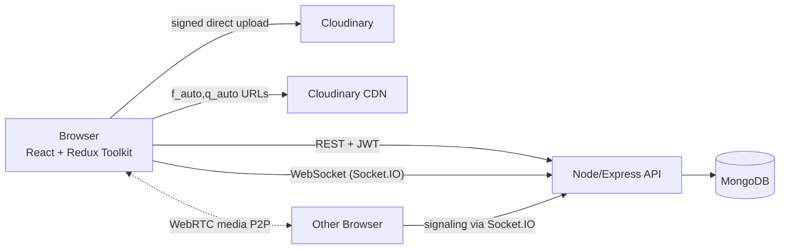

# Huddle — Interview Notes

> **Code:** `dev-aabhinav/project1`, branch `claude/huddle-mern-project-cgnc7q`, folder `server/`.
> **Reference (read-only, NOT my work):** `AadityanshuSingh/SocioSync`.
> **Rule:** every number here comes from something I actually ran in MY repo. Not run yet → **NOT MEASURED**.
>
> *Correction log:* an earlier version of this file described a Milestone 1 in a different repo
> (`Huddle-Real-Time-Social-Platform`). That code is not in `project1`, so it does not count.
> Milestone 1 was rebuilt from scratch in `project1` and everything below describes that build.

---

## 1. One-line pitch (30 seconds)

Huddle is a MERN social platform where users post, follow each other, chat in real time over
Socket.IO and make 1:1 video calls over WebRTC. I built it end to end — REST API with JWT auth,
React + Redux Toolkit frontend, Cloudinary image pipeline — and load-tested the chat server to find
its real capacity and first bottleneck. *(Status: only the Express foundation exists. Every capacity
number: NOT MEASURED.)*

---

## 2. Architecture

> Status: **target design**. Built so far: Express server + `GET /api/health` (M1).

**Data flow (target):** The browser calls REST endpoints with a JWT in the `Authorization` header;
middleware verifies it and the route reads/writes MongoDB. Chat messages go over a Socket.IO
connection (authenticated with the same JWT at handshake); the server **saves the message first, then
emits it** to the conversation's room and acks the sender. Images upload straight from the browser to
Cloudinary using a signature from our server, and are served through Cloudinary's CDN with
`f_auto,q_auto` transforms. Video calls use Socket.IO only to exchange SDP offers/answers and ICE
candidates; the audio/video flows peer-to-peer.

**Built so far (M1):** `server.js` (loads env, validates PORT, `http.createServer(app)`, listen,
graceful shutdown) → `app.js` (`createApp()`: json parser → `/api/health` → 404 → error handler).

---

## 3. Tech stack

| Tool | Layman meaning | Why used here | Alternative I didn't pick & why |
|---|---|---|---|
| Node.js 22 | Runs JavaScript outside the browser | One language front+back; event loop handles many idle connections (chat) well | Go/Java — better for CPU-heavy work, but second language + more boilerplate |
| Express 5.2.1 | The receptionist/router that sends each request to the right handler | Minimal, huge ecosystem; **v5 forwards async errors to the error handler automatically** (no try/catch in every route) | Express 4 (reference uses it; needs try/catch or wrapper everywhere); Fastify (faster, less familiar); NestJS (heavy) |
| dotenv 18 | Assistant who copies notes from the `.env` file into `process.env` | Local dev config without typing env vars every run; does nothing if no `.env` (production) | Node's built-in `node --env-file=.env` (Node ≥ 20.6) — fine too |
| nodemon 3 (dev only) | Auto-restarts server when I save a file | Dev convenience; in `devDependencies` so production never installs it | `node --watch` (built into Node) |
| CommonJS (`require`) | The older Node module style | Matches reference + most Express material | ESM (`import`) — modern standard; would also work |
| MongoDB | — | *(M2)* | — |
| React / Redux Toolkit | — | *(M10)* | — |
| Socket.IO | — | *(M8)* | — |
| WebRTC | — | *(M12)* | — |
| Cloudinary | — | *(M7)* | — |

---

## 4. Reference repo (SocioSync) vs my build

SocioSync is used only to see *what* to build. It has **no LICENSE**, so no code is copied; every
line in `project1` is written fresh. Its numbers/features do **not** count as mine.

**Reference endpoint count:** 23 routes, only 7 JWT-protected (not mine, just context).

| Area | SocioSync | My build | Why |
|---|---|---|---|
| Express | 4.18, try/catch in every controller | 5.2.1, one central error handler | async errors handled in one place |
| Structure | `index.js` builds app + listens | `app.js` (build) + `server.js` (listen) | tests use app without a port; Socket.IO attaches to `server` |
| dotenv | called too late in `index.js`, but also re-called in 4 other files → works by accident | loaded **once, first line** of `server.js`; (M2) all env read/validated in one `config/env.js` | single source of truth, fail fast |
| PORT | `process.env.PORT \|\| 4000`, no validation | `\|\|` + regex digits-only + range check, crash if invalid | typos must fail loudly |
| 404 | none (Express HTML page) | JSON 404 | API always answers JSON |
| Errors to client | `error.message` sent even for 500s | 5xx → generic message, real error only in server log | don't leak internals |
| Shutdown | none | graceful SIGINT/SIGTERM + 10 s force-exit | deploys don't cut off requests |
| nodemon / react-icons | in server `dependencies` | nodemon in `devDependencies`; react-icons removed | smaller, safer prod install |
| `.vscode/` | committed | gitignored | personal editor config |
| `.env.example` | missing | committed | new dev knows which vars exist |

**Known problems in SocioSync we will NOT repeat (later milestones):** OTP returned in API response
(account takeover), public `getallusers` leaking password hashes, unprotected chat routes (read
anyone's chat / spoof sender), unauthenticated sockets (join any room), OTP TTL 16.7 h instead of
1 min (`expires` is in seconds), `default: Date.now()` evaluated once, `for…in` over arrays, client
saving messages instead of server, no pagination/indexes, uploads proxied through server, STUN only +
no ICE candidate queue.

---

## 5. Milestones

### Milestone 1: Hello server ✅

**What I built:** An Express 5 server with `GET /api/health`, a JSON 404 handler, a central error
handler, validated PORT, startup-error handling and graceful shutdown on SIGINT/SIGTERM. The app is
built by `createApp()` (no `listen`) so tests can import it without opening a port.

**Files created** (reference used: `sociosync/server/index.js`, `sociosync/server/package.json`, `sociosync/.gitignore`)
- `server/package.json` (+ `package-lock.json`, generated)
- `server/.gitignore`
- `server/.env.example`
- `server/src/app.js`
- `server/src/server.js`

**Line-by-line notes for tricky lines**
- `"private": true` → `npm publish` refuses to upload the package to the public npm registry.
- `"express": "^5.2.1"` → allows `5.2.1 ≤ v < 6.0.0` (5.2.0 ✗, 5.9.3 ✓, 6.0.0 ✗). Lockfile pins exact versions → reproducible installs (`npm ci`).
- nodemon in `devDependencies` → in prod it would NOT slow the app (never required); costs are bigger/slower installs and a bigger supply-chain attack surface.
- `.gitignore`: `.env` then `.env.*` then `!.env.example` → last matching rule wins; `!` un-ignores. A leaked secret stays in git history → must **rotate** it, deleting the file is not enough.
- `app.disable("x-powered-by")` → hides `X-Powered-By: Express` (minor hardening, not real security).
- `express.json({ limit: "100kb" })` → parses JSON body text into a JS object on `req.body`; > 100 kb → **413**; malformed JSON → **400**. Must be registered **before** routes (they read `req.body`).
- 404 handler registered **after** routes → only reached if nothing matched. At the top it would 404 everything.
- Error handler `(err, req, res, next)` → Express detects error middleware by **4 parameters**. Delete `next` → treated as normal middleware → never receives errors.
- `if (res.headersSent) return next(err)` → reply already started, can't send a new status; hand to Express's built-in final handler, which closes the connection. **Not a loop:** `next` only moves forward through the middleware array (index only increases). Verified with a demo: our handler ran exactly once.
- `status >= 500 ? "Internal server error" : err.message` → 5xx details (DB host, file paths) could be misused by attackers, so hidden; 4xx message tells the client what to fix. 5xx are logged with `console.error`; 4xx not (log flooding).
- `require("dotenv").config({ quiet: true })` on line 1 → a top-level `const X = process.env.Y` in any file takes a **copy at require time**; if dotenv runs later, `X` stays `undefined` forever (demo: `bad.js` printed `undefined` while `process.env` was already filled). dotenv never overwrites an existing env var and never converts types.
- `const rawPort = process.env.PORT || "5000"` → env vars are strings or undefined. Only `""` behaves differently between `||` and `??`. Old code used `??` → `Number("")` = 0 → server silently bound a **random port** (found by testing, fixed). `"0"` is a non-empty string → truthy → kept by both.
- `/^\d+$/.test(rawPort) || port > 65535` → validate the **raw string**; `Number(" ")` and `Number("")` are 0, too forgiving.
- `http.createServer(app)` instead of `app.listen()` → we need the `server` object for Socket.IO (M8) and `server.close()`.
- `server.on("error")` → without a listener, an `"error"` event crashes the process with a stack trace; now: one clear line + exit 1 (e.g. `EADDRINUSE`).
- `server.address().port` → real port (matters when `PORT=0`, OS picks one).
- `server.close(cb)` → stops new connections immediately; in-flight requests finish naturally; `cb` runs when all are done → `process.exit(0)`. `if (err)` in `cb` only fires if the server wasn't running — a defensive branch, almost never runs.
- `setTimeout(..., 10_000).unref()` → safety net only: force `exit(1)` if close hangs. 10 s is a **maximum**, not a wait. `.unref()` = the timer alone never keeps the process alive.
- `process.on("SIGINT"/"SIGTERM")` → replaces Node's default (exit immediately). SIGKILL cannot be caught.

**MEMORISE (facts about MY build)**
- Route: `GET /api/health` → `200 {status:"ok", uptimeSeconds, timestamp}`. Public. Liveness only.
- Error shape for every error: `{ "error": "<message>" }`.
- PORT default `5000`; invalid PORT (`" "`, `abc`, `5000.5`, `70000`) → exit 1 with message; empty PORT → 5000.
- Body limit 100 kb → 413. Malformed JSON → 400.
- Startup error (port taken) → `Failed to start server: listen EADDRINUSE...`, exit 1.
- Shutdown results I ran: normal SIGTERM → exit **0** immediately; stuck request → exit **1** after **10 s**.
- Versions: Node v22.22.0, Express 5.2.1, dotenv 18.0.5, nodemon 3.1.14.
- Middleware order: `express.json` → routes → 404 → error handler.

**UNDERSTAND**
- HTTP request (method, path, headers, body) / response (status, headers, body); 2xx ok, 4xx client mistake, 5xx server mistake.
- Node event loop: one thread + non-blocking I/O → good for I/O-bound, bad for CPU-bound.
- Middleware pipeline, `next()` vs `next(err)`, registration order.
- Truthy/falsy; `||` replaces any falsy value, `??` only `undefined`/`null`. Env vars → `||`; real data where 0/""/false are meaningful → `??`.
- 12-factor config; secrets only in env, never in git.
- Liveness vs readiness: liveness fails → restart; readiness fails → stop sending traffic.
- Graceful shutdown, signals (SIGINT, SIGTERM, SIGKILL), exit codes (0 success, non-zero failure — read by Render/Docker/CI).

**Interview questions**
- *Node is single-threaded — how does it serve 1000 concurrent requests?* → Event loop + non-blocking I/O (libuv/OS handle the waiting). → *Follow-up: when does it break?* CPU-bound work blocks everyone → worker threads / separate service / one process per core.
- *What is middleware, why does order matter?* → `(req,res,next)` pipeline, runs in registration order (parser before routes, 404 after). → *Follow-up: how is an error handler recognised?* 4 parameters.
- *Why split app.js and server.js?* → Tests use the app without a port; Socket.IO + `server.close()` need the `http.Server`. → *Follow-up: why not `app.listen`?* It hides the server object.
- *Health check returns 200 but users get errors — how?* → It proves only liveness: not DB, not other routes. → *Follow-up: should it check the DB?* No — slow DB would fail all instances → LB removes all → cascading outage. Use a separate readiness probe (M2) and watch real routes' error rate.
- *What happens to in-flight requests on deploy?* → SIGTERM → `server.close()` → in-flight finish → exit 0; 10 s timer → exit 1 if stuck. → *Follow-up: WebSockets?* Never finish on their own → close Socket.IO explicitly (M8), clients reconnect.
- *Tell me about a bug you found.* → Empty `PORT` + `??` → `Number("")` = 0 → random port, no error. Fixed: `||` + validate raw string.

**Scaling questions**
- *What breaks first at 100x?* → One Node process = one core (machine has 4). Detect: one core 100%, event-loop lag, p99 rising. Fix: one process per core (cluster/PM2) → more machines behind a load balancer.
- *Why can we scale horizontally?* → App is stateless (no user data in process memory). Breaks if we keep sessions / socket rooms / caches in memory → use JWT (M3) + Redis adapter (M13).
- *Can the health check cause an outage?* → Yes, if it depends on the DB (cascading failure) or is expensive and probed often.
- *1 lakh users?* → Rough estimate only: 1 lakh × 1 req/10 s ≈ 10k req/s → likely more than one process → per-core processes + several instances. **Capacity NOT MEASURED (M9).**
- *10 lakh users?* → DB becomes the bottleneck before Node: caching, read replicas, later sharding; many socket servers + Redis adapter.

**Honest weaknesses + fix**
- Liveness only, no readiness → add `GET /api/ready` checking DB state (M2).
- `console.error` instead of structured logs; no request logging → pino/morgan later.
- No `helmet`, CORS or rate limiting yet → M3/M13.
- Malformed-JSON 400 shows the parser's raw message → replace with our own validation messages (M3).
- WebSockets will hold shutdown until the 10 s timeout → close Socket.IO first (M8).
- Second SIGTERM during shutdown prints the message twice and starts a second timer — cosmetic. *(I first claimed it would exit 1; tested it — wrong. The first close callback still exits 0, or the timer exits 1 if stuck.)*
- No automated tests yet → Jest + Supertest from M3.

---

## 6. Endpoints (source of truth for the "N endpoints" claim)

| # | Method | Path | Protected? | Milestone |
|---|---|---|---|---|
| 1 | GET | `/api/health` | No | M1 |

**Count so far: 1.** Resume claim "25+": **NOT YET TRUE.**

---

## 7. Benchmarks

No benchmark has been run yet. Machine specs must be captured **at the time of each benchmark**
(the cloud container changes between sessions — CPU seen as 4 vCPU Xeon @ 2.80 GHz in one session and
@ 2.10 GHz in another, 15 GiB RAM, Node v22.22.0).

| Metric | Value | Conditions |
|---|---|---|
| Endpoint count | 1 (in progress) | Counted from §6 |
| Chat p50/p95/p99 delivery latency @ N connections | NOT MEASURED | M9 |
| Chat error rate | NOT MEASURED | M9 |
| Call setup time (median / worst) | NOT MEASURED | M12 |
| Image payload reduction | NOT MEASURED | M7 |

---

## 8. Scaling section

- Current capacity of one instance: **NOT MEASURED** (M9).
- Bottlenecks at 10x / 100x / 1000x: to be filled from the real load test.
- Scaled architecture diagram: M14.

---

## 9. Resume lines (draft — only claims backed above may stay)

- ~~25+ RESTful endpoints~~ → currently 1. NOT YET TRUE.
- ~~Real-time chat, 500 connections, p95 ~45 ms~~ → NOT BUILT / NOT MEASURED.
- ~~WebRTC calling, median setup ~1.2 s~~ → NOT BUILT / NOT MEASURED.
- ~~Redux Toolkit; Cloudinary ~70% payload cut~~ → NOT BUILT / NOT MEASURED.
