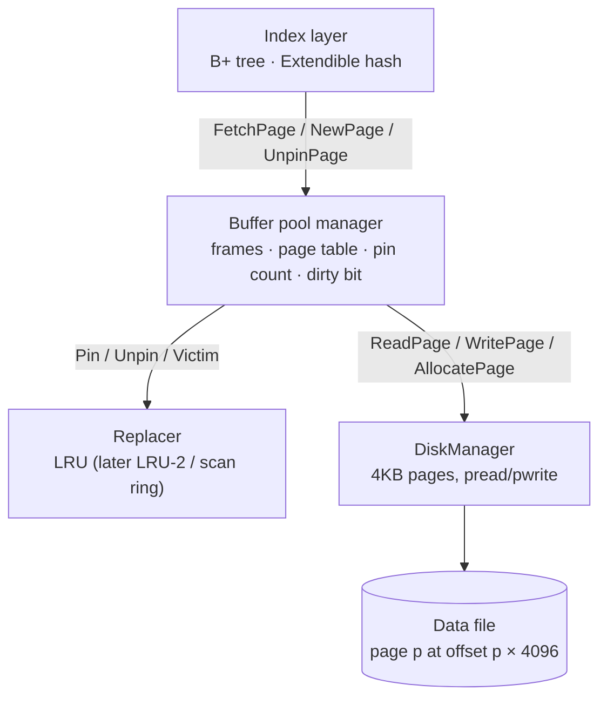

# Disk-Backed Index Engine — Interview Notes

Repo: `dev-aabhinav/project3` · C++17 · CMake · GoogleTest

---

## One-line pitch (30 seconds)

A single-threaded C++17 storage engine that stores data in 4KB pages on disk,
caches them in a buffer pool with pin counts and an O(1) LRU replacer, and
builds two disk-backed indexes on top: a B+ tree (point + range queries) and
extendible hashing (point queries). I benchmarked both against the STL
containers, warm and cold, and ran a sequential-flooding experiment on the
buffer pool. *(Benchmark numbers: NOT MEASURED yet.)*

---

## Architecture

**A lookup's journey (target design; built up milestone by milestone):**
The B+ tree asks the buffer pool for the root page id. The pool checks its
page table (page id → frame). On a hit it pins the frame and returns it; on a
miss it asks the replacer for a victim frame (only unpinned frames are
candidates), writes the victim back if dirty, then has the DiskManager read
the wanted page into that frame. The tree binary-searches the node, finds the
child page id, unpins the current page and repeats until it reaches a leaf.

---

## Tech stack / concept table

| Concept | Layman meaning | Why used here | Alternative I didn't pick, and why |
|---|---|---|---|
| Fixed 4KB pages | Register book where every page is the same size | Matches OS page + filesystem block; offset = id × 4096 | 8KB/16KB (Postgres/InnoDB): higher fanout but more waste per point read; 4KB is simplest |
| `pread` / `pwrite` | "Read at this exact position" in one call | No shared file cursor, no lseek race, one syscall | `fstream`: extra user-space buffering, double copy; `mmap`: OS controls eviction, no control over write-back order (bad for a DB) |
| OS page cache (no `O_DIRECT`) | The kernel quietly keeps file data in RAM | Simple, free read-ahead | `O_DIRECT`: avoids double caching, needed for honest "cold" numbers, but needs aligned buffers |
| CMake + FetchContent | Build recipe that downloads its own test library | Reproducible on a fresh cloud box or laptop | Makefile: not portable; system-only GTest: breaks on fresh machines |
| GoogleTest fixtures | Fresh table setup before each test | Each test gets its own file, no cross-test leakage | Catch2: also fine; GTest is the industry default |
| ASan + UBSan build | A watchman for memory bugs | We `memcpy` into raw 4KB buffers; catches overflow/use-after-free | Valgrind memcheck: slower (~20–50x) |

---

## Machine specs (cloud container, recorded 2026-10-05)

- `nproc`: 4
- CPU: Intel Xeon @ 2.80GHz (family 6 model 85, Cascade Lake), KVM guest, 1 thread/core
- Caches: L1d 128 KiB (4 × 32K), L2 4 MiB (4 × 1M), L3 33 MiB
- RAM: 15 GiB, no swap
- Compilers: g++ 13.3.0, clang++ 18.1.3; CMake 3.28.3; GoogleTest 1.14
- **perf: hardware counters NOT available** (`dmesg`: "no PMU driver, software
  events only"). Cache-miss numbers must come from my laptop (real) or
  cachegrind (simulated, labelled as such).

---

## Milestones

### Milestone 1: Project skeleton + DiskManager

**What I built:** a CMake project (static library `index_engine` + GoogleTest
binary `unit_tests`) and a `DiskManager` that reads/writes whole 4KB pages
to one file with `pread`/`pwrite`, allocates page ids, and recovers its page
count when the file is reopened.

**MEMORISE**
- `kPageSize = 4096` (`include/index_engine/config.h`)
- `page_id_t = int32_t`, `kInvalidPageId = -1` → max 2³¹ pages × 4KB = 8 TB per file
- Class `DiskManager` (namespace `index_engine`):
  `ReadPage(page_id, char* out)`, `WritePage(page_id, const char* data)`,
  `AllocatePage()`, `Sync()` (fsync), `NumPages()`, `NumReads()`, `NumWrites()`
- Offset = `static_cast<off_t>(page_id) * 4096` — cast **before** multiplying
  (int32 × 4096 overflows at page 524,288 = 2 GB)
- Open flags: `O_RDWR | O_CREAT`, mode `0644`; no `O_DIRECT`
- Reopen: `num_pages = file_size / 4096` via `fstat`
- Unwritten-but-allocated page reads back as zeros (EOF → `memset`)
- Copy constructor/assignment deleted (owns an fd → Rule of Three)
- Default build type Release; `-DENABLE_SANITIZERS=ON` gives ASan + UBSan
- 6 tests: NewFileHasNoPages, AllocateReturnsSequentialIds,
  WriteThenReadRoundTrip, UnwrittenPageReadsAsZeros, DataSurvivesReopen,
  InvalidPageIdThrows

**UNDERSTAND**
- Why fixed-size pages: devices/OS move blocks anyway; trivial offset math.
- Short reads/writes: syscalls may move fewer bytes than asked → loop; `EINTR` → retry.
- `pwrite` returning ≠ durable. Process crash: data safe in kernel cache.
  Power loss: can be lost. Only `fsync` guarantees it reached the device.
- OS page cache = second cache under our future buffer pool ("double buffering").
- Torn pages: a 4KB write is not atomic on power loss → checksums + WAL full-page
  writes (Postgres) or doublewrite buffer (InnoDB).
- Why the DiskManager doesn't cache: single responsibility; one place to count real I/O.

**Complexity**
- `ReadPage` / `WritePage`: O(1) syscalls, O(page size) bytes copied
- `AllocatePage`: O(1) (counter increment; file grows lazily on first write)
- Space: O(1) in memory; file = num_pages × 4KB

**Interview questions**
- Why 4KB? → OS page + FS block size, one page = one block. → *Follow-up:* when 8/16KB? Higher fanout for range scans/SSD, more waste per point read, worse torn writes.
- Why pread/pwrite? → explicit offset, one syscall, no shared cursor. → *Follow-up:* short reads? Loop until 4096 bytes; retry on EINTR.
- Is data on disk after WritePage? → No, OS cache; needs fsync. → *Follow-up:* why not fsync every write? Too slow; real DBs fsync the WAL at commit, flush data pages lazily.
- Why no caching here? → buffer pool's job. → *Follow-up:* double caching with OS cache? Yes; InnoDB uses O_DIRECT to avoid it.
- Crash-safe? → No: torn pages possible. → *Follow-up:* fix? Checksums + WAL full-page images / doublewrite.

**Scaling questions**
- 1M → 1B keys? → ~16 GB raw, ~25 GB with tree overhead; int32 ids fine (8 TB). RAM runs out first: OS cache can't hold the file, reads go from ~1 µs (cached) to ~100 µs (SSD). Detect via `NumReads()`, `iostat`. Fixes: bigger pool → O_DIRECT + own pool → io_uring async I/O → sharding.
- Many threads? → pread/pwrite are thread-safe, but `num_pages_++` and counters race → `std::atomic`; then device queue depth is the limit (io_uring).
- File bigger than one disk? → segment files (Postgres 1 GB segments) or partition across machines.

**Honest weaknesses + fixes**
- No free list: deleted pages never reused, file only grows → keep a free-page list (or bitmap) persisted in a header page.
- Allocated-but-never-written trailing pages are forgotten on reopen (count comes from file size) → persist `num_pages` in a header page.
- No `O_DIRECT`: "cold" pool reads may still come from OS cache → state this in every cold benchmark, or use O_DIRECT / drop caches.
- No checksums, no torn-page detection → CRC32 per page header.
- Not thread-safe (counter races).

---

## Benchmarks

All numbers: **NOT MEASURED** yet.

| # | Benchmark | Result | Conditions |
|---|---|---|---|
| 1 | Range scan: B+ tree vs `std::map`, 1M keys, warm + cold | NOT MEASURED | |
| 2 | Point lookup: extendible hash vs `std::unordered_map` (+ `std::map`) | NOT MEASURED | |
| 3 | Cache misses (perf stat / cachegrind): B+ tree vs `std::map` | NOT MEASURED — locality claim is a **hypothesis** | |
| 4 | Extendible hash growth under Zipfian skew | NOT MEASURED | |
| 5 | Sequential flooding: LRU vs fix, hit rate + p99 | NOT MEASURED | |

---

## Scaling section

*(Filled in fully at M14.)* Current design: single-threaded, single file,
no WAL, goes through OS page cache.

---

## Resume lines (DRAFT — not yet backed by measurements)

- Built a C++17 disk-backed storage engine: paged storage layer (4KB pages),
  buffer pool with LRU replacement, B+ tree with split/merge. *(merge on delete
  not built yet — M7)*
- Extendible hashing with bucket splits and directory doubling; profiled growth
  under Zipfian key skew. *(NOT MEASURED)*
- Benchmarks vs STL: *(all numbers NOT MEASURED; old "3.1x / 2.4x" claims removed
  until measured)*
